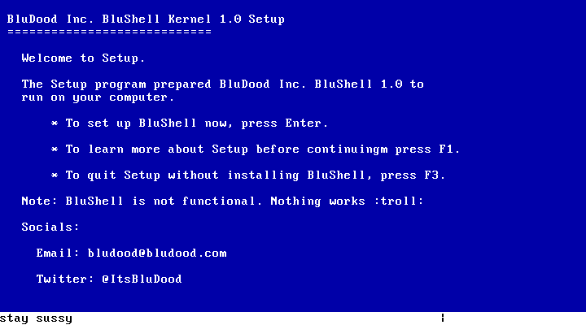

# BluShellOS
## The greatest iteration of BluShell.

Drop your Windows, Linux, macOS installations for the most light-weight and easy-to-use operating system yet.
## Features
* Setup
* 

## Running
1. Download the .iso from the [releases](https://github.com/BluDood/BluShellOS/releases)
2. Attach the .iso to a QEMU x86_64/i386 machine
3. Experience BluShell Setup

## Building
Just don't

## Credits
* Me
* [BluDood](https://bludood.com)
* [OSDev](https://wiki.osdev.org)
